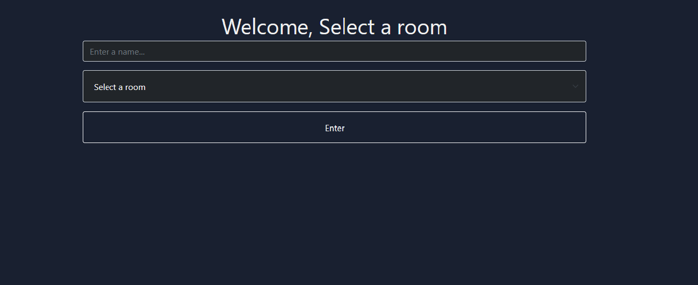

# vanila-chat-app
Personal Project

Basic Chat app that uses Node.js for backend, vanila Js frontend, socket.io and bootstrap for styling.

# Todo
* Kick user with same name
* Implement emojis

# Functionality
1. Read/Write messages
2. See online users
3. Notification when someone leaves / enters

